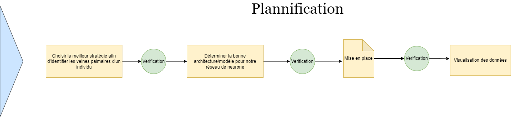

# Bloc à idée
> Date de création: 03/11/2022  
> Date de modification: 03/11/2022

### Cheminement du projet

### 1. Identification des veines palmaires d'un individu

**Idée 1:**  Utiliser un réseau de neuronne, avec pour entré les pixels d'une image 120x120
et obtenir en sortie un identifiant le caractérisant. Afin de facilement l'identifier l'individu plus tard

**Idée 2:** K-MEANS ou DBSCAN regrouper les points par veines, chaque nuages de points correspond a une veine, les points suffisement proches des unes et des autres formes une veine